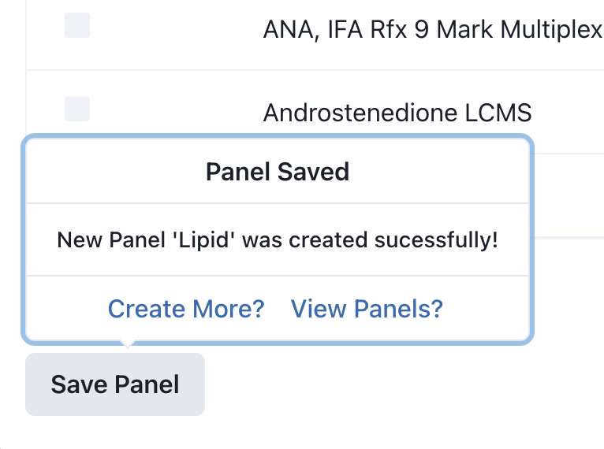
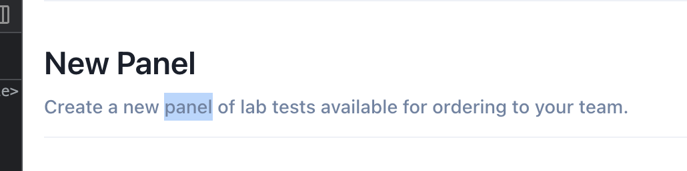

# Vital API Dashboard - New Panel Creation

View the static site [here](https://jonnypickard.github.io/vital-dashboard-app-react/panels/create).

## About

Example React App for creating: "New Panels". Panels enable Clients to order groups of Biomarker-tests for Users using the [Vital API Dashboard](https://app.tryvital.io/).

## Quickstart

### Install

```bash
npm install
```

### Environment

Vite on startup will look for a `.env.local` file in the root directory containing the following environment variables:

```bash
# .env.local

VITE_VITAL_LABS_API_URL=https://api.sandbox.eu.tryvital.io/v3/lab_tests/markers
VITE_VITAL_LABS_API_KEY='<Your EU Sandbox Key>'
```

To generate the `.env.local` file you can run the following:

```bash
# Generate .env.local

touch .env.local
echo "VITE_VITAL_LABS_API_URL=https://api.sandbox.eu.tryvital.io/v3/lab_tests/markers\nVITE_VITAL_LABS_API_KEY='<Your EU Sandbox Key>'" > .env.local
```

Please replace `<Your EU Sandbox Key>` with a valid key. You can generate required keys on the [Vital API Dashboard](https://app.tryvital.io/).

### Start

```bash
# Start development server

npm run dev
```

Uses [Vite dev server](https://vitejs.dev/guide/cli.html#dev-server)

### Tests

```bash
# Run unit tests

npm test
```

Unit tests are set up with [Vitest](https://vitest.dev/) & [React Testing Library](https://testing-library.com/docs/react-testing-library/intro/).

I normally will aim to test using an outside-in approach following User behaviour. For example:

1. User fills out form.
2. User submits form.
3. Validation is successfull.
4. Submit success message is shown.

This ensures business logic is covered without closely tieing tests to implementation details.

This is beneficial if you want to refactor implementation logic later on and usually results fewer tests to maintain.

## Caveats

### General

As I could have carried on working on this (I still have plenty of ideas for [further improvements](#further-improvements)), I aimed to provide the most value in areas that don't currently exist.

I mainly chose to focus on how New Panel creation could work and didn't spend as much time remaking existing features like the 'Your Panels' list.

### Form Submit

Due to the lack of a new panel creation endpoint I have done the bare basics & used a [little-state-machine](https://www.npmjs.com/package/little-state-machine) client side store to save panels with the following shape:

```ts
type Panel = {
  panelName: string;
  collectionMethod: string;
  // Uses slug value at the moment
  biomarkers: string[];
};
```

**I made the following assumptions:**

- The biomarker slug would be adequate as an id for constructing the new panel.
- The back end would assign a unique ID + meta data etc.
- The enpoint would allow for duplicate panel names so didn't add validation for unique name.

Finally in order to view the saved panels list for the test I didn't use the `/v3/lab_tests/` endpoint or copy its data structure. This was mainly because trying to mimic the behavior of this not yet existing endpoint didn't seem like a good use of time.

### Testing

I could have done more rigorous testing & covered more of the App. I've done the bare basic unit tests to cover creating new panels which I feel offer the most value for the time taken.

Given more time I would add more tests around table filtering behaviours & network conditions.

## 3rd Party Libraries

### [Vite](https://vitejs.dev/)

JavaScript build tool (similar to Webpack) that leverages widely supported modern browser features like ES Modules to dramatically simplify and speed up the build & development processes.

**Reasoning**: Vite appears to be a lot faster and easier to use than Webpack with a lot less configuration required & much faster compilation speeds.

### [React-Query](https://www.npmjs.com/package/@tanstack/react-query)

Async state management & data fetching.

**Reasoning**: Has easy to use handlers for most of the different scenarios during data fetching e.g. retries, caching, request cancellation, pagination & infinite scroll.

I believe for this app you would be able not use client side storage & just use this library.

### [Chakra-UI](https://chakra-ui.com/)

React component library.

**Reasoning**: It is already used in the dashboard & made it easier to match my code with current design standards. It also saved a lot of time vs making the components + logic. Finally, it has built in accessibility features which also saved time.

### [React-Hook-Form](https://www.react-hook-form.com/)

Form Hooks: "Performant, flexible and extensible forms with easy-to-use validation".

**Reasoning**: Very easy to use and lightweight form hooks. It saved me time working out custom form state logic + validation. It also should be easy to extend in the future if required. Finally, the [dev tools](https://www.react-hook-form.com/dev-tools/) are really nice to work with allowing you to see form state with ease.

### [TanStack Table](https://tanstack.com/table/v8)

Table Hooks: "Headless UI for building powerful tables & datagrids".

**Reasoning**: Very easy to build quite advanced tables with column filters, row selection & pagination. This saved a significant amount of time over manually writing the logic.

### [React-Router](https://reactrouter.com/en/main)

Client Side Routing

**Reasoning**: I didn't spend much time on this but I mainly used it to toggle bettween the `PanelsList` & `NewPanel` components. I think the actualy dashboard uses [NextJs](https://nextjs.org/) which would handle routing.

## Further Improvements

### Panel Submission

I currently just use a popover:



However, I feel like a confirmation modal would provide a better user experience.

e.g. "Do you wish to Save New Panel `<Panel Name>`"

The modal would show: `Name`, `Collection Type` & `Biomarkers`.

### Tooltips + Informative References

As we are dealing with abstract concepts a lot e.g. a `Panel` I think there are a lot of situations where it would be nice to refer users to more information.

For example:



It might be nice UX to have panel as a link to more information or have a tooltip explaining what it is.
